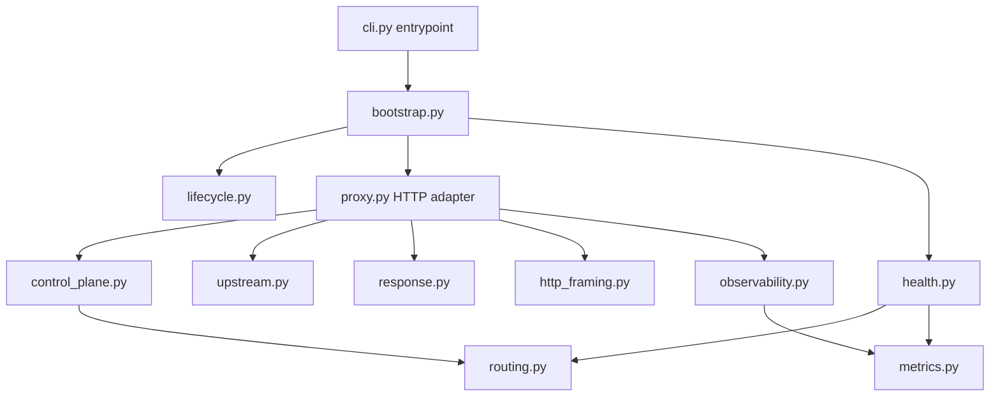

# Architecture

The load balancer uses a small layered architecture. The goal is to keep HTTP,
process management, routing policy, and observability independently replaceable
without introducing a framework or dependency-injection container.

## Dependency rule

Dependencies point toward stable policies:

- `routing.py` owns backend state and selection policy. It has no HTTP or CLI
  dependencies.
- `control_plane.py` exposes backend state and operator actions as view models.
  It does not know whether the caller is the current admin endpoint, a future
  JSON API, or a frontend-facing adapter.
- `upstream.py`, `response.py`, and `http_framing.py` contain HTTP protocol and
  safety policies that can be tested or replaced independently.
- `proxy.py` is the downstream HTTP adapter. It translates requests into use
  cases, coordinates retries, and converts results back into HTTP responses.
- `health.py`, `metrics.py`, and `observability.py` own background health and
  operational signals without changing routing or HTTP behavior.
- `bootstrap.py` is the composition root. Runtime objects are created there;
  leaf modules do not construct the full application.
- `lifecycle.py`, `server.py`, and `validation.py` are small shared
  infrastructure modules used by both executable services.

## Frontend integration

A future frontend should not import `ProxyRequestHandler` or inspect
`RoundRobinPool` internals. Add a frontend/API adapter that depends on
`ControlPlaneService` and frontend-specific read models. The existing
`BackendView` is the stable backend-state contract and already includes health,
operator state, draining state, and active requests.

Request-rate and latency charts should use a dedicated query/read-model service
fed by `ProxyObserver`; they should not parse Prometheus text or access metric
collector internals. `bootstrap.py` should wire that service into both the
observer and the future API adapter. This keeps writes on the proxy request path
small while allowing the UI schema to evolve separately from Prometheus labels.

Static frontend hosting and browser concerns such as cache policy, CORS, and
authentication belong in the future frontend adapter. They should not be added
to upstream transport or routing policy.

## Extension points

- Add routing algorithms by implementing the `BackendPool` protocol and
  extending the factory in `routing.py`.
- Add backend transports by providing another transport with the same exchange
  boundary used by `UpstreamTransport`.
- Add operational exporters behind `ProxyObserver` and `LoadBalancerMetrics`.
- Add control-plane transports—browser JSON, CLI, or authenticated admin
  APIs—on top of `ControlPlaneService`.
- Add background workers through the `BackgroundService` lifecycle protocol.

## Public compatibility

`load_balancer.proxy` remains the compatibility module for
`ProxyRequestHandler`, `ProxyHTTPServer`, and `create_proxy_server`. CLI names
and current HTTP endpoints remain unchanged by the internal restructuring.
