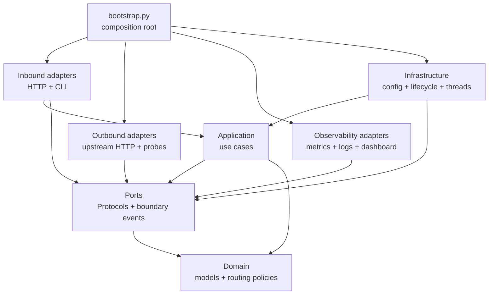
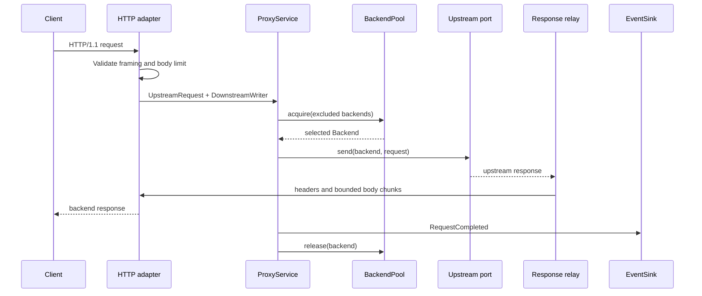
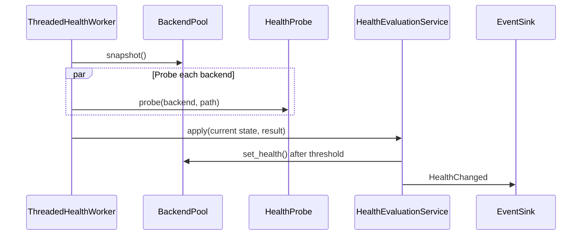

# Backend architecture

The backend is a synchronous HTTP/1.1 load balancer organized as a clean
architecture. The package structure makes one rule visible:

> Business decisions point inward; technical details point toward them.

The standard-library HTTP server, HTTPX, Prometheus, threads, CLI parsing, and
JSON are outer details. Backend state, routing policies, retry decisions,
health transitions, and administration are the stable center.

## Package map

```text
load_balancer/
├── domain/          Backend models, state, and routing policies
├── ports/           Protocols implemented by technical adapters
├── application/     Proxy, health, administration, and dashboard use cases
├── adapters/
│   ├── inbound/     CLI and downstream HTTP translation
│   ├── outbound/    Upstream HTTP and health-probe implementations
│   └── observability/
│                    Prometheus, structured logs, and dashboard projection
├── infrastructure/ Configuration, defaults, threads, lifecycle, and servers
└── bootstrap.py     The only production composition root
```

The package root deliberately contains no feature modules. Every implementation
belongs to the layer that owns its responsibility.

## Dependency rule


```mermaid
flowchart TD
    Bootstrap["bootstrap.py<br/>composition root"]
    Inbound["Inbound adapters<br/>HTTP + CLI"]
    Outbound["Outbound adapters<br/>upstream HTTP + probes"]
    Observe["Observability adapters<br/>metrics + logs + dashboard"]
    Infra["Infrastructure<br/>config + lifecycle + threads"]
    App["Application<br/>use cases"]
    Ports["Ports<br/>Protocols + boundary events"]
    Domain["Domain<br/>models + routing policies"]

    Bootstrap --> Inbound
    Bootstrap --> Outbound
    Bootstrap --> Observe
    Bootstrap --> Infra
    Inbound --> App
    Inbound --> Ports
    Outbound --> Ports
    Observe --> Ports
    Infra --> App
    Infra --> Ports
    App --> Ports
    App --> Domain
    Ports --> Domain
```

The enforced rules are:

- `domain` imports neither ports nor outer layers.
- `ports` may use domain models but never application or concrete adapters.
- `application` may use domain and ports but never infrastructure or adapters.
- adapters and infrastructure implement the inner contracts.
- `bootstrap.py` is allowed to know every concrete type because composition is
  its only job.

`backend/tests/test_architecture.py` reads imports with Python's AST and fails
when an inner layer imports a forbidden outer layer.

## Responsibilities

### Domain

`domain.models` contains `Backend` and immutable `BackendStatus` values.

`domain.routing` separates two concepts:

- `StatefulBackendPool` atomically owns health, operator state, draining state,
  active requests, and the selection cursor.
- `RoundRobinPolicy` and `LeastConnectionsPolicy` make selection decisions
  without owning backend state.

This separation makes a new algorithm a small policy rather than a new copy of
the concurrency and lifecycle rules.

### Ports

Ports describe what use cases need without selecting a library:

- `UpstreamTransportPort` opens an exchange with a selected backend.
- `DownstreamWriter` delivers headers and body bytes to the client.
- `HealthProbe` reports whether one backend probe succeeded.
- `EventSink` receives typed operational events.
- `Clock` and `RequestIdGenerator` isolate runtime-generated values.

The application can therefore be tested with small in-memory fakes and no
listening sockets.

### Application

`ProxyService` owns the main request policy:

1. acquire an eligible backend;
2. open an upstream exchange;
3. relay the bounded response;
4. retry only safe failures and safe methods;
5. classify the final outcome;
6. publish a typed completion event;
7. release every acquired backend in a `finally` block.

`HealthEvaluationService` owns consecutive success and failure thresholds. It
does not know about HTTPX, threads, or Prometheus.

`ControlPlaneService` owns enable, disable, drain, and list use cases.

`DashboardService` combines backend state with the bounded traffic read model.
It returns application dictionaries, while the HTTP adapter owns JSON encoding.

### Adapters and infrastructure

The inbound HTTP handler validates HTTP framing, dispatches local endpoints,
builds an `UpstreamRequest`, invokes a use case, and writes HTTP responses. It
does not select backends or decide retries.

The outbound HTTP adapter classifies connection and response failures. The
response relay preserves safe streaming and body limits behind downstream and
upstream ports.

Operational behavior uses typed events:

- `RequestCompleted`
- `RetryAttempted`
- `HealthChanged`
- `BackendOperatorStateChanged`

`CompositeEventSink` fans them out to Prometheus, structured JSON logs, and the
dashboard projection. Use cases do not import any of those implementations.

`ThreadedHealthWorker` schedules concurrent probes. `HttpHealthProbe` performs
the HTTP request. `HealthEvaluationService` decides whether state changes.

## Request flow


```mermaid
sequenceDiagram
    participant Client
    participant HTTP as HTTP adapter
    participant Proxy as ProxyService
    participant Pool as BackendPool
    participant Upstream as Upstream port
    participant Relay as Response relay
    participant Events as EventSink

    Client->>HTTP: HTTP/1.1 request
    HTTP->>HTTP: Validate framing and body limit
    HTTP->>Proxy: UpstreamRequest + DownstreamWriter
    Proxy->>Pool: acquire(excluded backends)
    Pool-->>Proxy: selected Backend
    Proxy->>Upstream: send(backend, request)
    Upstream-->>Relay: upstream response
    Relay->>HTTP: headers and bounded body chunks
    HTTP-->>Client: backend response
    Proxy->>Events: RequestCompleted
    Proxy->>Pool: release(backend)
```

For a retryable GET connection failure, `ProxyService` excludes the failed
backend, acquires a different one, publishes `RetryAttempted`, and repeats.
POST and DELETE requests are never retried after an ambiguous upstream failure.

## Health flow


```mermaid
sequenceDiagram
    participant Worker as ThreadedHealthWorker
    participant Pool as BackendPool
    participant Probe as HealthProbe
    participant Evaluate as HealthEvaluationService
    participant Events as EventSink

    Worker->>Pool: snapshot()
    par Probe each backend
        Worker->>Probe: probe(backend, path)
    end
    Worker->>Evaluate: apply(current state, result)
    Evaluate->>Pool: set_health() after threshold
    Evaluate->>Events: HealthChanged
```

Probes remain concurrent, and every backend continues to be checked even while
unhealthy so recovered services can rejoin rotation.

## Stable external behavior

The refactor intentionally preserves:

- the `load-balancer` and `demo-backend` commands;
- all CLI arguments and defaults;
- `/admin/backends`, `/metrics`, and `/api/v1/dashboard`;
- dashboard JSON fields and Prometheus metric names;
- Docker Compose and Makefile workflows.

Internal Python modules are not treated as a public API. Callers import from the
layer that owns the type, service, or adapter they need.

## How to extend the backend

- Add a routing algorithm by implementing `RoutingPolicy`, then expose it from
  the pool factory.
- Add another upstream client by implementing `UpstreamTransportPort`.
- Add telemetry by implementing `EventSink` and registering it in
  `bootstrap.py`.
- Add a control-plane transport by translating its input to
  `ControlPlaneService`.
- Add a health mechanism by implementing `HealthProbe`; threshold behavior
  remains unchanged.

## Scalability roadmap

The architecture creates boundaries for later runtime work without adding that
complexity now. Recommended order:

1. Benchmark the synchronous baseline and define latency and throughput goals.
2. Add reusable upstream connection pools.
3. Stream request bodies with bounded backpressure.
4. Add passive failure tracking, circuit breakers, probe jitter, and retry
   budgets.
5. Evaluate multiple worker processes or an asynchronous adapter using the same
   application ports.
6. Externalize backend configuration and operator state before running multiple
   load-balancer replicas.
7. Separate and authenticate administration traffic.
8. Export traces and aggregate dashboard data outside the process.

## Five-minute explanation

1. Start at `bootstrap.py`: it shows the entire running system being assembled.
2. Explain the inward dependency rule: policies do not know libraries.
3. Show `domain.routing`: state is atomic, algorithms are replaceable.
4. Show `ProxyService`: this is the request decision flow.
5. Show the HTTP handler: it only translates protocol details.
6. Show typed events fanning out to metrics, logs, and the dashboard.
7. Finish with the architecture test that enforces the dependency boundaries.
