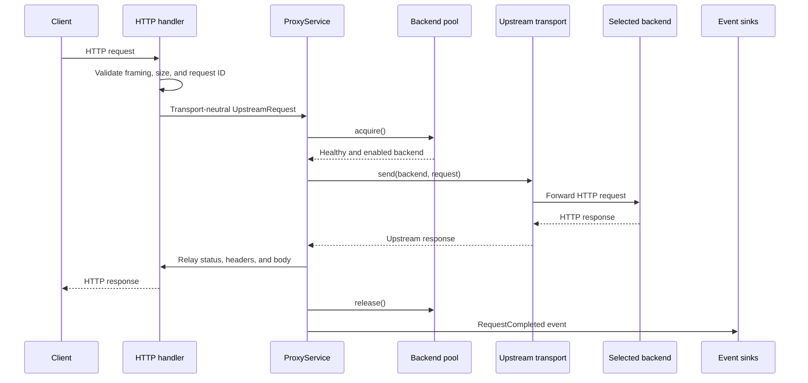
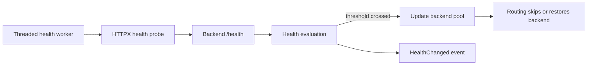
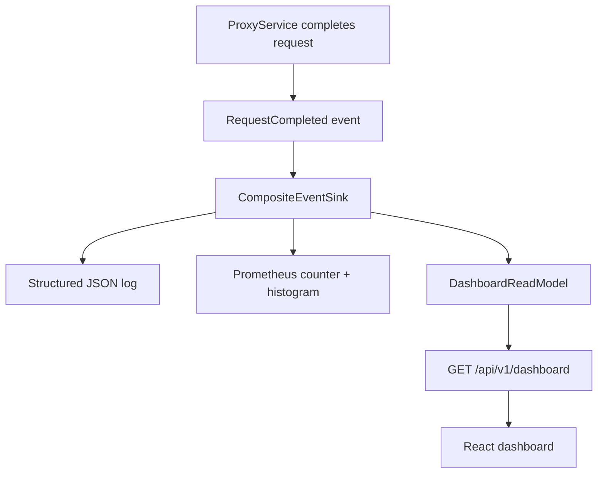
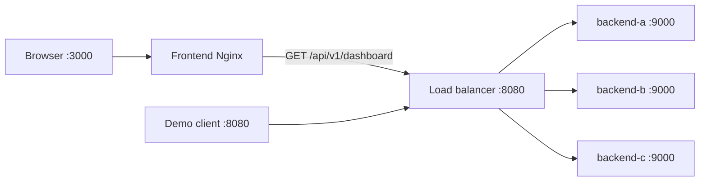

The shortest explanation of the project is:

> A client sends a request to one stable address. The load balancer chooses one
> available backend, forwards the request, returns the backend's response, and
> records what happened.

## 1. What problem does this project solve?

Imagine an application running on three servers:

```text
backend-a
backend-b
backend-c
```

Without a load balancer, the client would need to know which server to call. It
would also need to know whether that server is alive and how busy it is. That
couples every client to infrastructure details.

This project gives clients one address:

```text
http://127.0.0.1:8080
```

The load balancer hides the backend addresses and makes the routing decision.
This provides three important benefits:

1. **Distribution:** work can be shared across multiple servers.
2. **Availability:** an unhealthy server can be removed without changing the
   client.
3. **Observability:** traffic, failures, retries, and latency can be measured in
   one place.

This project is deliberately small enough to teach those ideas. It is not
trying to replace production tools such as Nginx, HAProxy, Envoy, or a cloud
load balancer. Envoy is an open-source proxy commonly used in cloud and
microservice systems for routing, load balancing, health checks, retries, and
traffic observability.

## 2. Proxy and reverse proxy

### What is a proxy?

A proxy is a program that stands between two other programs and passes
information between them.

```text
Program A  →  Proxy  →  Program B
Program A  ←  Proxy  ←  Program B
```

The proxy receives a request, sends another request on the caller's behalf,
receives the response, and relays that response back.

### What is a reverse proxy?

A traditional **forward proxy** represents clients. For example, employees may
send internet traffic through a company proxy. The destination server sees the
proxy rather than each employee's computer.

A **reverse proxy** represents servers. Clients call the reverse proxy without
needing to know which internal server will handle the request.

```text
                         ┌→ backend-a
Client → reverse proxy ──┼→ backend-b
                         └→ backend-c
```

### Why do we need a reverse proxy here?

The client knows only the load balancer at port `8080`. The load balancer knows
the private backend addresses, chooses an available one, and forwards the
request. That makes this load balancer a reverse proxy with a routing policy.

The project actually contains two reverse-proxy boundaries:

- The Python load balancer proxies application traffic to one of the demo
  backends.
- The production frontend's Nginx server proxies `/api/` dashboard requests to
  the Python load balancer. Nginx is a web server and reverse proxy; here it
  serves the compiled React frontend and forwards its API requests to the
  load balancer.

The Python reverse-proxy implementation is spread across these focused files:

- `backend/src/load_balancer/adapters/inbound/http/handler.py` translates the
  incoming client HTTP request into an application request.
- `backend/src/load_balancer/application/proxying.py` coordinates the use case.
- `backend/src/load_balancer/adapters/outbound/http/upstream.py` opens the HTTP
  connection to the selected backend.
- `backend/src/load_balancer/adapters/outbound/http/response.py` safely relays
  the backend response to the client.
- `frontend/nginx.conf` serves the React application and proxies `/api/` to the
  load-balancer container.

## 3. The complete request flow



Here is what each step means:

1. `ProxyRequestHandler` accepts `GET` or `POST`.
2. The handler validates HTTP framing and body limits before selecting a
   backend. Invalid or ambiguous requests are rejected early.
3. The handler preserves a valid `X-Request-Id` or generates a new one.
4. It creates an `UpstreamRequest` DTO and calls `ProxyService.execute()`.
   A DTO, or **Data Transfer Object**, is a simple object that carries related
   data between parts of the application without making business decisions.
5. `ProxyService` asks the backend pool to acquire an eligible backend.
6. The pool selects a backend and increments its active-request count as one
   atomic operation.
7. `UpstreamTransport` connects to that backend, replaces trusted forwarding
   headers, and sends the request.
   It handles **how to communicate** with the selected backend, including HTTP
   connections, timeouts, request headers, and connection-failure classification.
8. `ResponseRelay` preserves the backend status, safe headers, and response
   body while enforcing response limits.
   It safely transfers the backend's response back to the client and detects
   problems such as oversized or incomplete responses and client disconnections.
9. A `finally` block releases the backend on success, timeout, failure, or
   client disconnect.
10. `ProxyService` publishes a typed completion event. That one event feeds
    logs, Prometheus metrics, and the dashboard read model.

If there is no eligible backend, the load balancer returns:

```text
503 Service Unavailable
```

If it selected a backend but could not safely complete the exchange, it
normally returns:

```text
502 Bad Gateway
```

## 4. Round robin: repeated rotation

Round robin is the default routing strategy. It means selecting backends in a
repeated rotation:

```text
Request 1 → backend-a
Request 2 → backend-b
Request 3 → backend-c
Request 4 → backend-a
Request 5 → backend-b
Request 6 → backend-c
```

The implementation is in:

```text
backend/src/load_balancer/domain/routing.py
```

`RoundRobinPolicy.select()` starts at a shared cursor called `_next_index`,
walks around the backend list, and returns the first eligible backend. After a
selection, `StatefulBackendPool` moves the cursor to the position after the
selected backend.

The modulo operation makes the cursor wrap back to the beginning:

```text
next position = (selected position + 1) % number of backends
```

Round robin does not blindly send traffic to every configured backend. A
backend is eligible only when it is:

- healthy;
- enabled by the operator; and
- not excluded because it already failed during the current request.

For example, if `backend-b` is unhealthy, the sequence becomes:

```text
backend-a → backend-c → backend-a → backend-c
```

The project also supports `least-connections`. It selects the eligible backend
with the fewest active requests and uses round-robin position to break ties.
The policy is selected in
`backend/src/load_balancer/domain/routing.py:create_pool()` and configured with
the CLI `--strategy` option.

## 5. Why does routing need a lock?

The HTTP server is threaded, so multiple client requests may try to choose a
backend at the same time. Health checks and administration actions can also
change backend state while requests are arriving. **Threaded** means the server
can handle multiple requests concurrently in separate execution threads.

A lock is like a manager controlling access to a shared whiteboard. Only one
thread can read and update the routing state at a time.

Without the lock:

```text
Thread 1 reads cursor = backend-a
Thread 2 reads cursor = backend-a
Thread 1 selects backend-a and moves the cursor
Thread 2 also selects backend-a using its old value
```

Two requests would receive the same turn, and the rotation could become
incorrect. Active-request counts could also be lost if two threads updated the
same number concurrently.

With the lock:

```text
Thread 1 enters → selects A → increments A → moves cursor → leaves
Thread 2 enters → selects B → increments B → moves cursor → leaves
```

`StatefulBackendPool` creates a `threading.Lock` in:

```text
backend/src/load_balancer/domain/routing.py
```

The lock protects:

- the round-robin cursor;
- backend health;
- operator enabled/disabled state;
- draining state;
- active-request counts; and
- the creation of consistent snapshots.

The important operation is `acquire()`: selecting a backend and incrementing
its active count happen under the same lock. No other thread can observe the
backend as selected but not yet counted.

The lock is intentionally held only for small in-memory operations. Network
calls are made after leaving it. Holding a shared lock during an HTTP call would
serialize all traffic and destroy concurrency.

The concurrency behavior is tested by
`test_concurrent_selection_preserves_an_even_distribution()` in
`backend/tests/test_routing.py`.

## 6. Snapshots: when are they useful?

A snapshot is a stable copy of state at one moment.

The pool's `snapshot()` method returns an ordered tuple of immutable
`BackendStatus` objects. It copies all backend states while holding the routing
lock, then releases the lock.

Snapshots are useful when a reader needs a coherent view but should not keep
the system locked while it performs slower work.

This project uses routing snapshots for:

- `GET /admin/backends`, so an operator sees each backend consistently;
- `GET /api/v1/dashboard`, so the dashboard sees health, enabled state,
  draining state, and active requests;
- health-check cycles, so the worker obtains the backend list and then performs
  network probes without holding the routing lock; and
- tests, so state can be asserted without exposing mutable dictionaries.

The dashboard also has its own snapshot. `DashboardReadModel.snapshot()` copies
traffic totals, per-backend statistics, and recent requests under a separate
lock.

A snapshot is not a live subscription. State can change immediately after it
is created, and that is acceptable. Its guarantee is internal consistency, not
that the world will remain unchanged.

The relevant files are:

- `backend/src/load_balancer/domain/models.py`
- `backend/src/load_balancer/domain/routing.py`
- `backend/src/load_balancer/application/administration.py`
- `backend/src/load_balancer/application/dashboard.py`
- `backend/src/load_balancer/infrastructure/health_worker.py`

## 7. Why do we need health checks?

Round robin is useful only if it avoids servers that cannot handle traffic.
Health checks let the load balancer discover failures before sending new client
requests to a failed backend.

By default, the project requests each backend's `/health` endpoint every two
seconds. The probes run concurrently, so one slow backend does not delay the
others.

The health flow is:



Responsibilities are separated:

- `infrastructure/health_worker.py` decides **when** and concurrently runs
  probes.
- `adapters/outbound/http/health_probe.py` decides **how** to make an HTTP
  probe.
- `application/health.py` decides **when a series of results means the state
  should change**.
- `domain/routing.py` owns the final health state used by routing.

The default thresholds are:

- two consecutive failures to mark a healthy backend unhealthy;
- two consecutive successes to restore an unhealthy backend.

Thresholds prevent one temporary network problem from constantly removing and
restoring a backend. This stability is sometimes called avoiding **flapping**.

Health and operator intent are deliberately separate. If an operator disables a
backend, a successful health check does not re-enable it. The backend must be
both healthy and enabled to receive new traffic.

## 8. Retries

A retry means making another backend attempt after the first attempt fails.
Retries can improve availability, but they can also repeat work.

The retry policy lives in:

```text
backend/src/load_balancer/application/proxying.py
```

Defaults live in:

```text
backend/src/load_balancer/infrastructure/defaults.py
```

The default policy allows one additional attempt only when:

- the method is `GET`;
- the failure is a connection timeout or connection failure;
- the configured retry limit has not been reached; and
- another eligible backend has not already been attempted.

The failed backend is placed in `attempted_backends`, and the next
`pool.acquire()` call excludes it.

The project does **not** retry:

- `POST`;
- response timeouts;
- failures after the backend may have started processing the request; or
- oversized/invalid backend responses.

That conservative rule is more important than retrying everything. Availability
must not come at the cost of accidentally performing an operation twice.

The retry behavior is tested without sockets in
`backend/tests/test_proxy_service.py`, especially:

- `test_retries_safe_failure_and_releases_every_backend`
- `test_does_not_retry_mutating_request`

It is also covered end to end in `backend/tests/test_proxy.py`.

## 10. Logs added to the project

Logs explain individual events. This project writes compact structured JSON
instead of prose so log systems can search and aggregate fields reliably.

Typed events are declared in:

```text
backend/src/load_balancer/ports/events.py
```

They are converted to JSON logs in:

```text
backend/src/load_balancer/adapters/observability/events.py
```

Important events include:

- `proxy_request_completed`
- `backend_health_changed`
- `backend_operator_state_changed`

A completed-request log contains fields such as:

```json
{
  "event": "proxy_request_completed",
  "method": "GET",
  "path": "/demo",
  "status": 200,
  "backend": "backend-a",
  "outcome": "completed",
  "request_id": "example-request-1",
  "duration_ms": 1.25
}
```

Headers and bodies are intentionally not logged because they may contain
passwords, tokens, personal data, or large payloads.

The architecture uses a `CompositeEventSink`. One application event is fanned
out to:

1. Prometheus metrics;
2. the in-memory dashboard read model; and
3. structured logs.

This keeps `ProxyService` independent of Prometheus, JSON, logging libraries,
and React. It only publishes a meaningful business event.

For a presentation, the clearest way to see logs is in the
[Docker Desktop Containers view](https://docs.docker.com/desktop/use-desktop/container/):

1. Open Docker Desktop.
2. Select **Containers**.
3. Expand the `load-balancer` Compose application.
4. Select the `load-balancer` container.
5. Open its **Logs** view.

New JSON events appear as requests are made. Docker Desktop also lets you
search the log output for values such as `proxy_request_completed`,
`backend_health_changed`, or a specific request ID.

The terminal equivalent remains useful as a fallback:

```bash
docker compose logs --follow load-balancer
```

## 11. Metrics endpoint

Metrics summarize behavior across many requests. They answer questions such as:

- How many requests completed?
- Which backend handled them?
- How many failed?
- How many retries happened?
- How long did requests take?
- Which backends are healthy?

Prometheus metrics are implemented in:

```text
backend/src/load_balancer/adapters/observability/metrics.py
```

They are exposed by the HTTP handler at:

```text
GET http://127.0.0.1:8080/metrics
```

The main metric families are:

| Metric | Type | Meaning |
| --- | --- | --- |
| `load_balancer_proxy_requests_total` | Counter | Completed requests by method, status, outcome, and backend |
| `load_balancer_proxy_request_duration_seconds` | Histogram | End-to-end proxy latency |
| `load_balancer_backend_healthy` | Gauge | `1` for healthy and `0` for unhealthy |
| `load_balancer_backend_health_transitions_total` | Counter | Health state changes |
| `load_balancer_proxy_retries_total` | Counter | Safe additional backend attempts |

Logs and metrics are complementary:

- Use a **log** to investigate one request using its request ID.
- Use a **metric** to understand a trend across thousands of requests.

Request IDs are not metric labels. Every unique label value creates another
Prometheus time series, so using request IDs would create unbounded
cardinality.

## 12. Latency histogram

Latency is how much time the request takes. In this project, the measured
duration begins when `ProxyService.execute()` starts and ends at the final
classified result. It includes backend selection and the proxy exchange.

A histogram does more than calculate one average. It counts observations in
duration buckets and also exports a total count and sum:

```text
load_balancer_proxy_request_duration_seconds_bucket
load_balancer_proxy_request_duration_seconds_count
load_balancer_proxy_request_duration_seconds_sum
```

This lets Prometheus calculate questions such as:

- What percentage of requests completed under 100 ms?
- What is the 95th-percentile latency?
- Did latency increase only for one backend or outcome?

Why not use only the average? Ten fast requests and one extremely slow request
can produce an acceptable-looking average while one user had a terrible
experience. Histograms preserve the distribution needed to see tail latency.

The histogram labels are bounded values: method, outcome, and backend. The
dashboard currently calculates a simple average for easy presentation, while
the `/metrics` endpoint retains histogram data for Prometheus analysis.

## 13. Observability flow



The dashboard flow is:

1. `DashboardEventSink` records completed requests and retries.
2. `DashboardService` combines traffic aggregates with a backend-state
   snapshot.
3. `ProxyRequestHandler` serializes it at `GET /api/v1/dashboard`.
4. The React hook in `frontend/src/hooks/useDashboard.ts` requests a new
   snapshot every five seconds.
5. React renders summary cards, the backend table, and recent requests.

The dashboard is read-only. Operator actions are intentionally available only
on the direct load-balancer port, not through the frontend Nginx `/api/`
boundary.

Dashboard traffic history is held in memory and resets when the load-balancer
process restarts.

## 14. Clean architecture: where each responsibility belongs

The backend follows this dependency direction:

```text
Adapters / Infrastructure
          ↓
      Application
          ↓
         Ports
          ↓
         Domain
```

The main areas are:

| Area | Responsibility | Important examples |
| --- | --- | --- |
| `domain/` | Stable business state and routing rules | Backend models, round robin, least connections, locks |
| `ports/` | Contracts the application needs | Upstream transport, downstream writer, health probe, events |
| `application/` | Use-case orchestration | Proxying, health evaluation, administration, dashboard queries |
| `adapters/inbound/` | Translate incoming input | CLI and HTTP handler |
| `adapters/outbound/` | Talk to external backends | HTTP transport, response relay, HTTPX probe |
| `adapters/observability/` | Make events operationally visible | Logs, Prometheus, dashboard projection |
| `infrastructure/` | Runtime mechanics | Configuration, defaults, threads, lifecycle, HTTP server |
| `bootstrap.py` | Construct the production application | Wires every concrete implementation together |

The reason for this separation is not just organization. The routing and retry
decisions can be tested with in-memory fakes, without Docker or real sockets.
Technical libraries can change without moving the core rules.

A **response relay** safely transfers a selected backend's HTTP response to the
original client while preserving its status and safe headers, enforcing body
limits, and detecting timeouts, incomplete responses, or disconnections.

The architecture dependency rule is automatically checked by:

```text
backend/tests/test_architecture.py
```

## 15. Docker topology

`compose.yaml` starts five services:



Only two ports are published to the host:

- `3000`: production React dashboard through Nginx;
- `8080`: proxied application traffic and local operational endpoints.

The three demo backends are private inside the Compose network. This is
important: clients should reach them through the load balancer, not bypass it.

The demo backends use the same Python image but receive different names. Their
JSON responses identify which backend handled each request, making the routing
algorithm visible.

### Why Docker fits this project

Docker is not required to implement the load-balancing algorithm, and it is not
automatically better for every application. It is useful here because the
behavior being demonstrated depends on several independent processes and a
realistic network boundary.

The main advantages for this project are:

1. **Independent servers:** `backend-a`, `backend-b`, and `backend-c` run as
   separate containers. One can stop or fail without terminating the other
   backends or the load balancer. This makes failure isolation visible.
2. **Repeatable environment:** each container starts with the same packaged
   application and dependencies, reducing differences between computers.
3. **Easy replication:** Compose creates three backend instances from the same
   image with different names. They are separate server instances, not three
   different backend implementations.
4. **Real service networking:** containers communicate through the private
   Compose network using DNS names such as `backend-a`. Only the frontend and
   load-balancer entry points are exposed to the host.
5. **Declarative startup:** `compose.yaml` records the services, commands,
   ports, network, health checks, and startup dependencies in one place.
6. **Operational demonstration:** Docker Desktop makes it easy to inspect
   health and logs or deliberately stop and restart one backend during the
   presentation.
7. **Simple cleanup:** the complete environment can be created and removed
   without manually managing five long-running processes and their ports.

Without Docker, the same demonstration would require starting the frontend,
load balancer, and three backend processes separately, assigning their ports,
keeping their dependencies consistent, and stopping them individually. Docker
Compose turns that setup into one reproducible application topology.

For a presentation, say:

> “Docker lets us run each service as an isolated process with its own lifecycle
> while connecting them through a predictable private network. The three
> backends use the same image, but they are independent server instances. That
> lets us stop one server, observe the load balancer remove it, and prove that
> the rest of the application continues running. Compose also makes the entire
> environment reproducible with one declared configuration.”

Docker provides process and network isolation, but this local Compose setup is
still a demonstration rather than a complete production platform. Production
deployments commonly add orchestration, persistent monitoring, authentication,
secrets management, and multiple load-balancer instances.

## 16. Important endpoints

| Method and path | Purpose |
| --- | --- |
| `GET /any-application-path` | Proxy a request to a selected backend |
| `POST /any-application-path` | Proxy a bounded body without retries |
| `GET /admin/backends` | Read backend health and operator state |
| `POST /admin/backends/{name}/disable` | Stop new work going to one backend |
| `POST /admin/backends/{name}/enable` | Allow an eligible backend to receive work |
| `POST /admin/backends/{name}/drain` | Stop new work and let active work finish |
| `GET /metrics` | Prometheus exposition endpoint |
| `GET /api/v1/dashboard` | Read-only JSON used by React |

The administration, metrics, and dashboard endpoints are unauthenticated and
share the local listener. Do not expose this demonstration configuration to the
public internet.

## 17. How to test the project

### Choosing a tool for sending requests

`curl` is useful for automation, but it is not the clearest presentation tool.
These are the main alternatives:

| Tool | Best use | Tradeoff |
| --- | --- | --- |
| **Postman** | Recommended for this demo: saved requests, formatted JSON, headers, status, and response time | Requires preparing a small collection |
| **Project dashboard** | Best visual summary of routing, health, failures, and latency | Read-only; it cannot send application or administration requests |
| **Docker Desktop** | Best visual control of containers, health, logs, stop, and restart | It manages the runtime but is not an HTTP client |
| **VS Code REST Client** | Keeps reproducible HTTP requests in a `.http` file next to the code | Less visual for a nontechnical audience |
| **Bruno or Hoppscotch** | Good graphical HTTP-client alternatives to Postman | Adds another tool when Postman is already available |
| **curl** | Best for scripts, CI, and quick terminal checks | Raw output is less polished during a presentation |

Because Postman and Docker Desktop are already installed, the clearest
presentation combination is:

```text
Postman          → send and inspect HTTP requests
Docker Desktop   → control containers and inspect logs
Browser dashboard → explain the whole system visually
VS Code          → connect behavior to the implementation
```

### Tools

For the recommended visual demonstration, use:

- [Docker Desktop](https://docs.docker.com/desktop/use-desktop/container/)
  with Docker Compose;
- [Postman](https://learning.postman.com/docs/use/use-collections/create-collections/);
- a browser;
- VS Code; and
- `make`.

The automated `make docker-smoke` command additionally uses `curl` and Python 3
on the host. They are needed by the script, not by the Postman presentation.

For local development without Docker, also install:

- Python 3.12;
- Node.js and npm.

### Complete automated verification

```bash
make install
make check
```

`make check` runs:

- Ruff backend linting;
- all backend tests;
- all frontend component and hook tests;
- TypeScript checking; and
- the Vite production build.

### Full Docker integration test

```bash
make docker-up
make docker-smoke
make docker-down
```

The smoke test verifies:

1. the load balancer and frontend become ready;
2. all three backends become healthy;
3. the frontend serves the React shell;
4. the frontend can proxy the dashboard API;
5. initial requests reach A, B, and C;
6. stopping A removes it from traffic;
7. B and C continue serving requests;
8. restarting A restores its health; and
9. A rejoins routing.

The executable test is:

```text
scripts/docker-smoke.sh
```

### Focused tests for the core ideas

```bash
make -C backend test PYTEST_ARGS="-q backend/tests/test_routing.py"
make -C backend test PYTEST_ARGS="-q backend/tests/test_proxy_service.py"
make -C backend test PYTEST_ARGS="-q backend/tests/test_health.py"
make -C backend test PYTEST_ARGS="-q backend/tests/test_proxy.py"
```

These cover the routing lock, snapshots, retries, releases, health thresholds,
metrics, logs, proxy framing, and end-to-end HTTP behavior.

## 18. A practical demo for other people

This demo takes approximately 8–10 minutes. Its main visual workspace uses
Postman, Docker Desktop, the React dashboard, and VS Code. The terminal is used
only to start and clean up the complete stack.

### Prepare Postman once

Create a Postman collection named `Load Balancer Demo`.

Add a collection variable:

| Variable | Value |
| --- | --- |
| `baseUrl` | `http://127.0.0.1:8080` |

[Current Postman versions](https://learning.postman.com/docs/use/send-requests/variables/variables/)
use one local value by default rather than the older separate “initial” and
“current” value fields. Open the collection's **Variables** tab, add `baseUrl`,
and use `{{baseUrl}}` in every saved request.

#### If Postman cannot connect

The variable definition and request URL are different:

```text
Collection variable name:  baseUrl
Collection variable value: http://127.0.0.1:8080
Request URL:                {{baseUrl}}/demo
```

Check these items:

1. Use `http`, not `https`.
2. Make sure `baseUrl` has a local value and is enabled in the collection's
   **Variables** tab.
3. Save the request inside the same `Load Balancer Demo` collection so it can
   access the collection variable.
4. Hover over `{{baseUrl}}` in the URL. Postman should show the resolved value
   `http://127.0.0.1:8080`. Red text means the variable is unresolved or empty.
5. If using Postman in a web browser, select the
   [Desktop Agent](https://learning.postman.com/latest-v-12/docs/getting-started/basics/about-postman-agent)
   so the request can reach a service running on the local computer.
6. Test the literal URL `http://127.0.0.1:8080/demo`. If the literal URL works
   but `{{baseUrl}}/demo` fails, the problem is the variable's scope or value.
7. Confirm the Docker Desktop `load-balancer` container is running and maps
   host port `8080` to container port `8080`.

Save these requests in the collection:

| Request name | Method | URL |
| --- | --- | --- |
| Route request | `GET` | `{{baseUrl}}/demo` |
| Backend snapshot | `GET` | `{{baseUrl}}/admin/backends` |
| Dashboard JSON | `GET` | `{{baseUrl}}/api/v1/dashboard` |
| Prometheus metrics | `GET` | `{{baseUrl}}/metrics` |
| Disable backend C | `POST` | `{{baseUrl}}/admin/backends/backend-c/disable` |
| Enable backend C | `POST` | `{{baseUrl}}/admin/backends/backend-c/enable` |

For `Route request`, add this request header:

| Header | Value |
| --- | --- |
| `X-Request-Id` | `postman-demo-{{$guid}}` |

[`{{$guid}}` is a Postman dynamic variable](https://learning.postman.com/docs/postman/environments-and-globals/variables-list/),
so every send receives a distinct request ID while retaining the searchable
`postman-demo-` prefix. This keeps the demonstration realistic and makes the
requests easy to find in Docker Desktop logs.

Postman's **Pretty** JSON response view makes the selected `backend`,
`request_id`, forwarded context, and path much easier to explain than raw
terminal output.

### Before the presentation

Start the application from the project directory:

```bash
make docker-up
```

Now open Docker Desktop:

1. Go to **Containers**.
2. Find and expand `load-balancer`.
3. Confirm that `frontend`, `load-balancer`, `backend-a`, `backend-b`, and
   `backend-c` are running and healthy.

This view is useful at the beginning because the audience can see that the
system really contains five separate containers.

Open the React dashboard in the browser:

```text
http://127.0.0.1:3000
```

Keep these four windows ready:

1. the browser dashboard;
2. the Postman collection;
3. Docker Desktop's `load-balancer` container list; and
4. VS Code with `FLOW.MD` and
   `backend/src/load_balancer/domain/routing.py`.

### Part 1: introduce the stable entry point

Say:

> “There are three application servers, but the client knows only one address:
> the load balancer on port 8080.”

In Postman, open **Route request** and click **Send** repeatedly. Point to the
formatted `backend` field after every response:

```text
backend-a
backend-b
backend-c
backend-a
...
```

Explain that this is round robin: repeated, fair rotation.

For an automated visual run, Postman's Collection Runner can execute the route
request for several iterations. Repeated manual sends are usually easier for a
short talk because the audience can watch each routing decision.

### Part 2: connect the demo to the routing code

Switch to VS Code and show:

```text
backend/src/load_balancer/domain/routing.py
```

Explain:

- `RoundRobinPolicy` calculates the next choice.
- `StatefulBackendPool` owns the cursor and backend states.
- the lock protects the rotation from concurrent requests;
- `acquire()` selects and increments atomically; and
- `release()` always runs from `ProxyService`'s `finally` block.

### Part 3: show observability

Switch to the browser dashboard. Wait up to five seconds for its next refresh,
then point out:

- total requests;
- available backends;
- average latency;
- failures and retries;
- per-backend request counts; and
- the recent request stream.

In Docker Desktop, select the `load-balancer` container and open **Logs**.
Search for `postman-demo-`. Point out the backend, status, outcome,
duration, and request ID in the structured JSON event.

In Postman, send **Prometheus metrics**. The response is Prometheus text rather
than JSON. Search the response for:

```text
load_balancer_proxy_requests_total
load_balancer_proxy_request_duration_seconds
load_balancer_backend_healthy
```

Explain that one completion event feeds three different views:

- Docker Desktop shows the individual structured log;
- Postman shows the Prometheus metrics endpoint; and
- the React dashboard shows a human-friendly operational summary.

### Part 4: demonstrate failure isolation

In Docker Desktop:

1. Return to the expanded `load-balancer` application.
2. Select `backend-a`.
3. Use its **Stop** action.
4. Keep `backend-b`, `backend-c`, `load-balancer`, and `frontend` running.

This is clearer than hiding the failure behind a command: the audience can see
the backend container stop while the rest of the application remains alive.

After the configured health threshold is reached, the browser dashboard marks A
unhealthy. In Postman, click **Send** on **Route request** several more times.

In the code, `ThreadedHealthWorker.check_once()` collects the failed probe, and
`HealthEvaluationService.apply()` identifies `backend-a` as unhealthy after the
failure threshold and calls `BackendPool.set_health(..., healthy=False)` to
remove it from the eligible routing set.

Only B and C should appear. Say:

> “The client did not change its address. Health checks changed the eligible
> routing set, so round robin continued across the remaining healthy servers.”

Return to Docker Desktop and use the **Start** action for `backend-a`.

After two successful load-balancer probes, the dashboard marks A healthy.
Repeated Postman requests eventually show A again.

In the `load-balancer` container logs, search for
`backend_health_changed`. Show the transition to unhealthy and the later
transition back to healthy.

### Part 5: demonstrate operator control

Health answers “Can this backend work?” Operator state answers “Should this
backend receive new work?”

In Postman, send **Disable backend C**. Its formatted response shows:

```json
{
  "name": "backend-c",
  "healthy": true,
  "enabled": false
}
```

Send **Backend snapshot** and show that C is physically healthy but
administratively disabled. Send **Route request** repeatedly and confirm that C
does not receive traffic.

Send **Enable backend C** to restore its state.

Explain that health recovery never overrides a deliberate operator disable.

### Part 6: close with retry safety

Open `backend/tests/test_proxy_service.py` in VS Code and show these two tests:

- `test_retries_safe_failure_and_releases_every_backend`
- `test_does_not_retry_mutating_request`

The first test gives the proxy a simulated sequence in which `backend-a` has a
connection timeout and `backend-b` succeeds:

```text
GET → backend-a times out → retry backend-b → success
```

Point out that the result is `completed_after_retry`, the selected result
backend is `backend-b`, and a `RetryAttempted` event was recorded.

The second test uses the same kind of connection failure for a `POST` request:

```text
POST → backend-a times out → no retry → 502
```

Point out that the result still names `backend-a`. The proxy does not try
`backend-b`, because the failed request may have performed its write before the
connection problem became visible.

Run both scenarios:

```bash
make -C backend test \
  PYTEST_ARGS="-q -vv backend/tests/test_proxy_service.py -k 'retries_safe_failure or does_not_retry_mutating_request'"
```

The two `PASSED` results prove both sides of the policy: a safe connection
failure gets one additional attempt on a different backend, while a mutating
request does not.

Say:

> “Both requests encounter the same backend connection failure. The GET safely
> retries on backend B and succeeds. The POST returns 502 without trying another
> backend, because repeating a write could duplicate an order, payment, or other
> side effect. The request ID helps correlate attempts, but it does not prevent
> duplicate work and is not an idempotency key.”

### Cleanup

The most reliable cleanup remains:

```bash
make docker-down
```

You can also stop the Compose application from Docker Desktop when you want to
leave its containers available for another run. Use `make docker-down` when you
want the repository's defined, repeatable container-and-network cleanup.

## 19. Five-minute explanation script

If time is short, use this talk track:

1. **Problem:** “Clients should not know or monitor individual servers.”
2. **Reverse proxy:** “The load balancer is the stable server-facing proxy.”
3. **Routing:** “Round robin repeatedly rotates across eligible backends.”
4. **Concurrency:** “A lock protects the shared cursor and counters so threaded
   requests cannot corrupt the rotation.”
5. **Snapshots:** “Readers get a consistent copy without holding the lock during
   network or presentation work.”
6. **Health:** “Concurrent probes remove failed servers after a threshold and
   restore recovered servers.”
7. **Retry safety:** “Only safe GET connection failures get one additional
   attempt; writes are never retried.”
8. **Observability:** “One typed completion event becomes a JSON log, Prometheus
   metrics, and dashboard data.”
9. **Demo:** “Stop A; traffic continues through B and C. Restart A; it rejoins.”
10. **Architecture:** “Core decisions stay independent of HTTP, Prometheus,
    React, and threads, which makes them easier to test and change.”

## 20. Common questions

### Is the frontend the load balancer?

No. React displays a read-only operational dashboard. Nginx serves React and
proxies only `/api/`. The Python process on port `8080` performs the actual
backend selection and application proxying.

### Does round robin mean every backend always receives the same number?

It gives turns fairly among eligible backends over time. Health changes,
operator actions, retries, and in-flight timing can make totals temporarily
different.

### Why not hold the lock for the entire request?

Network requests can be slow. Holding the routing lock during a backend call
would make other client requests wait and would remove the benefit of a
threaded server.

### Are health checks the same as Docker health checks?

No. Docker health checks decide whether Compose considers a container healthy.
The load balancer's own health worker decides whether a backend is eligible for
application traffic. Both are useful at different layers.

### Does a retry guarantee success?

No. It makes one additional safe attempt when policy allows. The next backend
can also fail, or there may be no other eligible backend.

### Is the dashboard persistent?

No. Its recent history and aggregates live in the load-balancer process and
reset when that process restarts. Prometheus would normally scrape and store
metrics externally in a larger deployment.

### Why are there both logs and metrics?

Logs describe specific events in detail. Metrics efficiently summarize large
numbers of events and support rates, alerts, and latency percentiles.

## 21. Final mental model

Think of the load balancer as a careful traffic manager:

- the **HTTP handler** receives and validates the vehicle;
- the **routing pool** decides which road is eligible;
- **round robin** gives each open road a repeated turn;
- the **lock** prevents two traffic officers from changing the same sign at
  once;
- a **snapshot** is a consistent photograph of current traffic;
- **health checks** close and reopen failed roads;
- **retries** choose another road only when repeating the trip is safe;
- **logs** describe individual trips;
- **metrics** summarize all trips;
- the **latency histogram** shows the distribution of trip times; and
- the **dashboard** makes the system understandable to a human.

That is the core of this project: safe selection, reliable forwarding, failure
awareness, and visible outcomes behind one stable client address.
