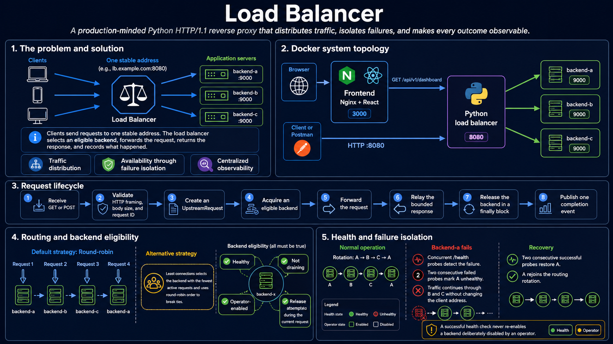
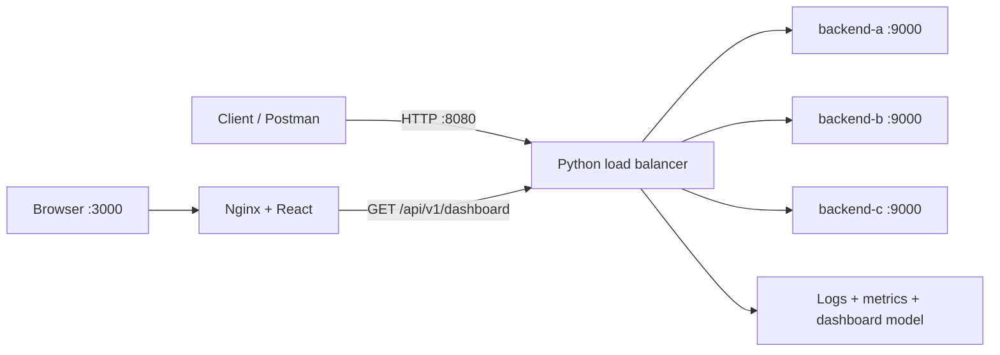

# Learning Load Balancer

A production-minded, synchronous HTTP/1.1 reverse proxy built in Python to make
load-balancing behavior easy to inspect, test, and explain.

Clients use one stable address. The load balancer selects an eligible backend,
forwards the request, safely relays the response, and records the result through
logs, Prometheus metrics, and a React dashboard.



## Highlights

- Round-robin and least-connections routing.
- Thread-safe backend selection and active-request accounting.
- Concurrent health probes with failure and recovery thresholds.
- Separate automatic health and operator-controlled enable/disable state.
- Graceful backend draining.
- One conservative retry for safe `GET` connection failures by default.
- Bounded request and response bodies.
- Trusted forwarding headers and request-ID propagation.
- Structured JSON logs, Prometheus metrics, and a read-only dashboard.
- Reproducible five-container Docker Compose demonstration.
- Clean architecture with executable dependency rules.

## System overview



The React application is an operational dashboard; it does not balance traffic.
The Python process on port `8080` performs backend selection, health evaluation,
retries, forwarding, and response delivery.

For one proxied request:

```text
Client request
    → validate framing and size
    → create an internal UpstreamRequest
    → acquire an eligible backend
    → forward through UpstreamTransport
    → relay the bounded backend response
    → release the backend
    → publish one completion event
```

## Quick start with Docker

Docker is the recommended way to run the complete demonstration. It provides
five isolated services, a private network, health checks, reproducible
dependencies, and the ability to stop one backend without stopping the rest of
the application.

Requirements:

- Docker Desktop, or Docker Engine with Compose v2.
- `make`.

Start the complete stack:

```bash
make docker-up
```

Compose builds and starts:

- `frontend`: unprivileged Nginx serving the React production build;
- `load-balancer`: the Python reverse proxy;
- `backend-a`, `backend-b`, and `backend-c`: independent demo servers created
  from the same Python image.

Open or call:

| Address | Purpose |
| --- | --- |
| `http://127.0.0.1:3000` | React operational dashboard |
| `http://127.0.0.1:8080/demo` | Proxied application request |
| `http://127.0.0.1:8080/admin/backends` | Backend health and operator state |
| `http://127.0.0.1:8080/metrics` | Prometheus metrics |
| `http://127.0.0.1:8080/api/v1/dashboard` | Dashboard JSON read model |

Send several requests to observe backend rotation:

```bash
curl http://127.0.0.1:8080/demo/1
curl http://127.0.0.1:8080/demo/2
curl http://127.0.0.1:8080/demo/3
```

Useful lifecycle commands:

```bash
make docker-ps
make docker-logs
make docker-smoke
make docker-down
```

`make docker-smoke` verifies startup, frontend delivery, routing through all
three backends, failure isolation, and backend recovery.

If ports `3000` or `8080` are occupied, override them:

```bash
LOAD_BALANCER_PORT=18080 FRONTEND_PORT=13000 make docker-up
```

When running the smoke test with custom ports, also provide matching
`LOAD_BALANCER_URL` and `FRONTEND_URL` values.

## Demonstrate failure isolation

Stop one backend:

```bash
docker compose stop backend-a
```

After two failed load-balancer probes, `backend-a` becomes unhealthy and is
removed from the eligible routing set. Requests continue through `backend-b`
and `backend-c` without changing the client address.

Restore it:

```bash
docker compose start backend-a
```

After two successful probes, `backend-a` becomes healthy and rejoins rotation.
The dashboard and the `backend_health_changed` structured log show both
transitions.

## Routing and resilience

A backend is eligible only when it is:

- healthy according to the load balancer;
- enabled by the operator;
- not draining; and
- not already attempted during the current request.

The supported routing strategies are:

- `round-robin`: rotates fairly through eligible backends;
- `least-connections`: chooses the eligible backend with the fewest active
  requests and uses round-robin order to break ties.

The backend pool protects shared health, operator, draining, active-request, and
cursor state with a lock. Selection and active-request increment happen
atomically. Every acquired backend is released in a `finally` block.

Health probes run concurrently every two seconds by default. Two consecutive
failures mark a backend unhealthy, and two consecutive successes restore it.
Operator intent remains separate: a successful probe never re-enables a backend
that an operator disabled.

### Retry safety

The default policy allows one additional attempt only when:

- the method is `GET`;
- the failure is a connection timeout or connection failure;
- another eligible backend is available; and
- the retry limit has not been reached.

`POST`, response timeouts, and response-phase failures are not retried. This
avoids repeating work after a backend may already have performed a
write. The same request ID is carried through a retry for correlation, but a
request ID is not an idempotency key.

## Administration and operational endpoints

| Method and path | Purpose |
| --- | --- |
| `GET /any-application-path` | Proxy a `GET` request |
| `POST /any-application-path` | Proxy a bounded `POST` body without retries |
| `GET /admin/backends` | Read backend health, operator, drain, and active-request state |
| `POST /admin/backends/{name}/enable` | Allow an eligible backend to receive new requests |
| `POST /admin/backends/{name}/disable` | Stop new requests by operator decision |
| `POST /admin/backends/{name}/drain` | Stop new assignments and let active work finish |
| `GET /metrics` | Return Prometheus exposition text |
| `GET /api/v1/dashboard` | Return the read-only dashboard snapshot |

Example operator actions:

```bash
curl -X POST http://127.0.0.1:8080/admin/backends/backend-c/disable
curl http://127.0.0.1:8080/admin/backends
curl -X POST http://127.0.0.1:8080/admin/backends/backend-c/enable
```

## HTTP safety

- Requests must use unambiguous `Content-Length` framing.
- `Transfer-Encoding`, duplicate content lengths, and bodies on `GET` are
  rejected before backend selection.
- Request and response bodies are limited to 1 MiB by default.
- Framed responses are relayed in 64 KiB chunks; responses without a usable
  length are bounded-buffered.
- Hop-by-hop headers are removed.
- Client-provided forwarding headers are replaced with trusted
  `X-Forwarded-For`, `X-Forwarded-Host`, and `X-Forwarded-Proto` values.
- A valid client `X-Request-Id` is preserved; otherwise one is generated.
- Connection and response waits have separate two-second defaults.
- Graceful shutdown stops new traffic and waits for active request threads.

The proxy returns:

- `502 Bad Gateway` when a selected backend exchange fails;
- `503 Service Unavailable` when no eligible backend exists;
- an internally recorded `499` outcome when the client disconnects.

## Observability

Each completed request emits one typed event. A composite event sink sends it to
three views:

- structured JSON logs for individual request investigation;
- Prometheus metrics for aggregated behavior;
- an in-memory dashboard read model for human inspection.

Important metric families include:

- `load_balancer_proxy_requests_total`;
- `load_balancer_proxy_request_duration_seconds`;
- `load_balancer_backend_healthy`;
- `load_balancer_backend_health_transitions_total`;
- `load_balancer_proxy_retries_total`.

Request IDs appear in logs and responses but are intentionally excluded from
Prometheus labels to avoid unbounded metric cardinality. Dashboard history is
bounded and resets when the load-balancer process restarts.

## Local development

Requirements:

- Python 3.12 or newer;
- Node.js with npm;
- `make`.

Install backend and frontend dependencies:

```bash
make install
```

Run the non-Docker stack in separate terminals:

```bash
make demo-a
make demo-b
make demo-c
make backend
make frontend
```

The local defaults are:

- load balancer: `http://127.0.0.1:8080`;
- demo backends: ports `9001`, `9002`, and `9003`;
- Vite dashboard: `http://127.0.0.1:5173`.

Show available project commands with:

```bash
make help
```

## Configuration

The load balancer validates configuration before starting. Backend definitions
use repeatable `NAME=http://HOST:PORT` arguments:

```bash
make backend BACKEND_ARGS="\
--listen-host 0.0.0.0 \
--listen-port 8088 \
--strategy least-connections \
--upstream-connect-timeout 1 \
--upstream-response-timeout 5 \
--max-retries 1 \
--max-request-body-bytes 1048576 \
--max-response-body-bytes 1048576 \
--health-path /ready \
--health-interval 5 \
--health-timeout 1 \
--health-failure-threshold 3 \
--health-success-threshold 2 \
--backend api-a=http://127.0.0.1:9001 \
--backend api-b=http://127.0.0.1:9002"
```

Run `.venv/bin/load-balancer --help` after installation for the complete CLI
reference.

The demo backend accepts `--name`, `--host`, `--port`, and
`--max-body-bytes`. Equivalent environment variables are `BACKEND_NAME`,
`BACKEND_HOST`, `BACKEND_PORT`, and `BACKEND_MAX_BODY_BYTES`.

## Tests and continuous integration

Run every local quality check:

```bash
make check
```

This runs:

- Ruff against the Python backend;
- 102 backend tests;
- 19 frontend tests;
- TypeScript checking;
- the Vite production build.

Run the complete Docker integration workflow:

```bash
make docker-up
make docker-smoke
make docker-down
```

GitHub Actions runs the same application-quality checks, builds both container
images, starts the Compose stack, runs the end-to-end smoke test, prints logs on
failure, and always performs cleanup.

## Project structure

```text
backend/src/load_balancer/
├── domain/          Backend state and routing policies
├── ports/           Dependency-inversion protocols and events
├── application/     Proxy, health, administration, and dashboard use cases
├── adapters/
│   ├── inbound/     CLI and downstream HTTP translation
│   ├── outbound/    Upstream HTTP, response relay, and health probes
│   └── observability/
│                    Metrics, structured logs, and dashboard projection
├── infrastructure/ Configuration, validation, threads, and lifecycle
└── bootstrap.py     Production composition root

frontend/            React dashboard and Nginx configuration
scripts/             End-to-end Docker smoke test
compose.yaml         Five-service local topology
```

Dependencies point inward toward stable policies. The domain does not import
HTTP, Prometheus, threads, or React. An architecture test rejects forbidden
inner-to-outer imports.

## Scope and limitations

This is a learning project, not a replacement for HAProxy, Envoy, Nginx, or a
managed cloud load balancer. It intentionally does not provide:

- TLS termination, HTTP/2, HTTP/3, or raw TCP balancing;
- authentication for administration, metrics, or dashboard endpoints;
- distributed state or multiple load-balancer replicas;
- automatic service discovery;
- rate limiting, caching, or persistent observability storage.

The Compose ports bind to `127.0.0.1`. Keep the operational endpoints local and
do not expose this demonstration configuration to the public internet.

## Learning documents

- [FLOW.MD](docs/FLOW.MD) explains the request flow, routing, concurrency, health,
  retries, idempotency, observability, Docker topology, and presentation steps.
- [CONCEPTS.md](docs/CONCEPTS.md) is a compact glossary for reviewing the project’s
  terminology.
- [script.md](docs/script.md) contains the project demonstration and recording
  walkthrough.
